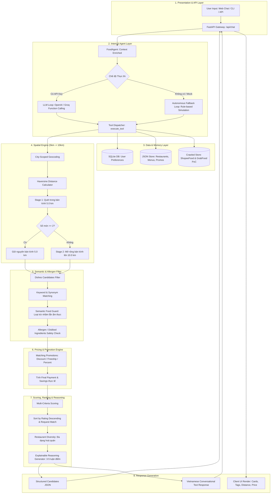
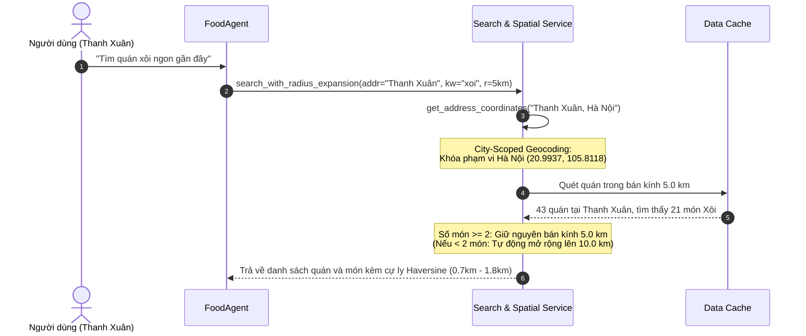
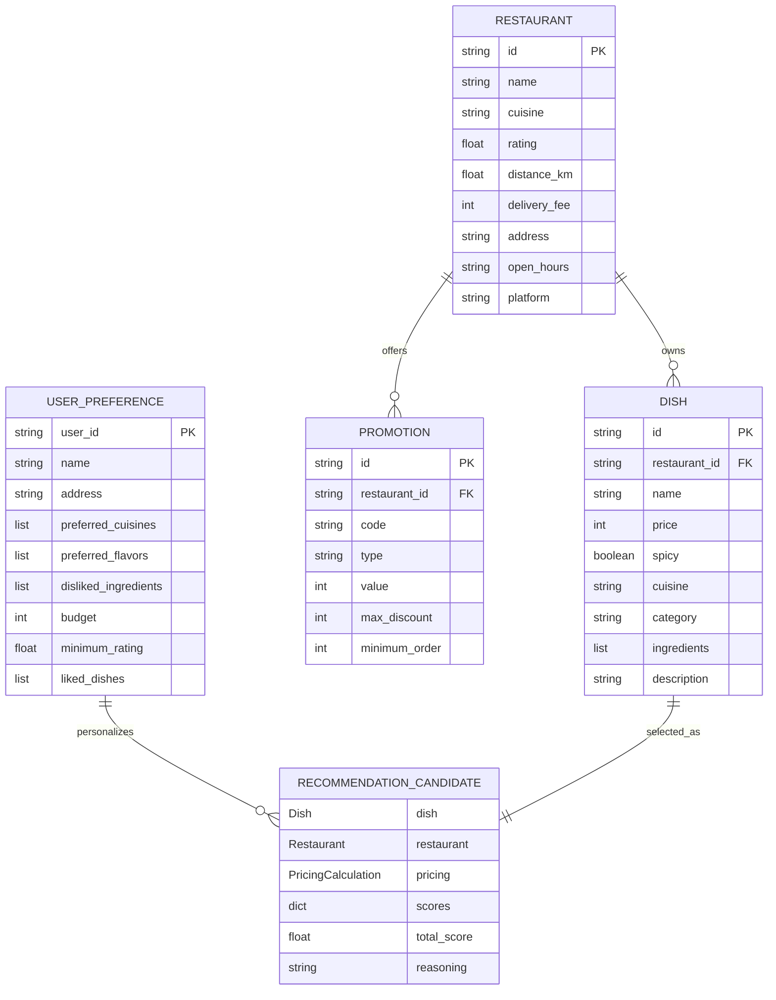

# Kiến Trúc Luồng Xử Lý Pipeline (Personal Food Agent Pipeline Architecture) 🍜

> **Tài liệu đặc tả kiến trúc luồng dữ liệu & thuật toán của hệ thống Trợ lý Ăn uống Thông minh (Personal Food Agent)**  
> *Phiên bản: 2.0.0 — Cập nhật: 2026*

---

## 1. Tổng Quan Kiến Trúc (Architecture Overview)

Hệ thống **Personal Food Agent** vận hành theo mô hình **Pipeline Hướng Tác Tử (Agentic Pipeline)** kết hợp giữa **Mô hình Ngôn ngữ Lớn (LLM Function Calling)**, **Bộ máy Định vị Không gian Động (Dynamic Spatial Engine)**, **Bộ quy tắc Lọc Văn hóa Ẩm thực (Semantic Food Guard)** và **Bộ chấm điểm Đa tiêu chí Có thể Giải thích (Explainable Multi-Criteria Ranking Engine)**.

### Sơ Đồ Luồng Tổng Thể (End-to-End Flowchart)



---

## 2. Chi Tiết Từng Giai Đoạn Trong Pipeline (Pipeline Stages)

### Giai đoạn 1: Tiếp nhận yêu cầu & Bổ sung ngữ cảnh (Context Ingestion)
* **Đầu vào:** Câu thoại người dùng (ví dụ: *"tìm quán xôi ngon gần đây"*), kèm tọa độ/địa chỉ gửi từ client (`user_address: "Thanh Xuân, Hà Nội"`), định danh người dùng (`user_id: "user_01"`).
* **Nạp Profile Cá nhân:** Hệ thống tự động truy vấn SQLite [`database/picky_eaters.db`](database/picky_eaters.db) để lấy:
  * Khẩu vị: `preferred_cuisines` (món Việt, Hàn, Nhật...), `preferred_flavors` (cay, ngọt...).
  * Dị ứng / Kiêng khem: `disliked_ingredients` (hành lá, ớt, bò, tôm...).
  * Ngân sách: `budget` (mặc định 80.000đ nếu chưa đặt).
  * Lịch sử món từng thích: `liked_dishes`.

---

### Giai đoạn 2: Phân tích Ý định & Điều phối Công cụ (Intent Routing & Tool Dispatcher)
Hệ thống sử dụng cơ chế lai (Hybrid Orchestration):
1. **Chế độ LLM (khi có OpenAI/Groq API Key):** Mô hình ngôn ngữ tự động chọn gọi các function định nghĩa trong [`agent/tools.py`](agent/tools.py):
   * `get_user_preferences`
   * `update_user_preference`
   * `recommend_dishes_with_radius`
2. **Chế độ Autonomous Fallback Engine (khi chạy offline / mock):**
   * Tự động phát hiện ý định cập nhật khẩu vị (*"không ăn hành"*, *"thích ăn cay"*, *"budget 100k"*).
   * Phân tách từ khóa món ăn cụ thể (`food_keywords`: xôi, phở bò, bún chả, cơm tấm...) trước khi xét đến nhóm ẩm thực tổng quát.
   * Chuyển đổi yêu cầu thành tham số tìm kiếm có cấu trúc.

---

### Giai đoạn 3: Phân lập Không gian & Mở rộng Bán kính Động (Spatial Engine)



#### Các cơ chế an toàn toạ độ:
* **City-Scoped Geocoding ([`get_address_coordinates`](services/search.py#L75)):**
  * Tách biệt rõ 2 tập quận: Hà Nội (Cầu Giấy, Thanh Xuân, Ba Đình...) và TP.HCM (Quận 1, Quận 8, Bình Thạnh...).
  * **Giải quyết dứt điểm lỗi nhầm lẫn địa lý:** Nếu địa chỉ quán có chữ *"142 Ba Đình, Quận 8, TP.HCM"*, hệ thống nhận diện từ khóa `TP.HCM` và `Quận 8` trước, không bao giờ nhầm thành `Quận Ba Đình, Hà Nội` nữa.
* **Haversine Distance ([`haversine_km`](services/search.py#L60)):**
  * Tính khoảng cách đường chim bay chính xác giữa GPS người dùng và GPS quán ăn.
  * Đối với các quán cùng quận, hệ thống nội suy khoảng cách thực tế từ 0.7km đến 2.2km dựa trên vị trí phố.

---

### Giai đoạn 4: Bộ Lọc Ngữ Nghĩa & An Toàn Ẩm Thực (Semantic Food Guard)

* **Từ điển đồng nghĩa đa cấp ([`KEYWORD_SYNONYMS`](services/search.py#L343)):**
  * Khi tìm `"xoi"`, hệ thống mở rộng tìm kiếm: `xoi xeo`, `xoi chim`, `xoi ga`, `xoi suon`, `xoi thit`, `xoi bap`, `xoi ngo`, `xoi man`, `xoi pate`...
* **Ranh giới từ khóa (Word Boundary Regex `\b`):**
  * Tránh việc từ khóa ngắn bị khớp lộn xộn vào giữa các từ không liên quan.
* **Bộ lọc phân định văn hóa ẩm thực (Cultural Disambiguation):**
  ```python
  # Ngăn chặn "cơm gà xối mỡ" bị nhận nhầm thành món "xôi"
  if norm_kw in ["xoi", "xoi xeo", "xoi chim", "xoi ga"] and "xoi mo" in text and "com" in text:
      if not any(x in text for x in ["xoi xeo", "xoi ga", "xoi chim", "xoi suon", ...]):
          return False
  ```
* **Lọc dị ứng & nguyên liệu ghét ([`is_ingredient_disliked`](services/search.py#L256)):**
  * Đối chiếu từng thành phần món với danh sách nguyên liệu cấm của người dùng. Nếu vi phạm (ví dụ: món chứa `hành lá`, `hành phi` mà người dùng ghét hành), món ăn lập tức bị loại trừ khỏi danh sách đề xuất.

---

### Giai đoạn 5: Bộ Tính Giá & Tối Ưu Ưu Đãi (Pricing & Promotion Engine)

Hàm [`calculate_final_price`](services/pricing.py#L5) kiểm tra toàn bộ mã giảm giá đang kích hoạt của quán:
1. **Mã giảm tiền mặt (`discount`):** Trừ trực tiếp vào giá món nếu đạt `minimum_order`.
2. **Mã miễn phí vận chuyển (`freeship`):** Trừ vào phí vận chuyển của quán.
3. **Mã giảm phần trăm (`percent`):** Tính % chiết khấu có áp trần (`max_discount`).
4. **Kết quả:** Chọn ra phương án khuyến mãi có lợi nhất cho khách hàng, tính toán chính xác:
   $$\text{Final Price} = \text{Giá món} - \text{Giảm giá} + \text{Phí ship sau ưu đãi}$$

---

### Giai đoạn 6: Chấm Điểm Đa Tiêu Chí & Xếp Hạng Theo Đánh Giá (Scoring & Ranking)

Mỗi món ăn $i$ cùng quán ăn $j$ được tính vector điểm đa chiều:

$$\text{Total Score} = S_{\text{preference}} + S_{\text{request}} + S_{\text{price}} + S_{\text{distance}} + S_{\text{rating}} + S_{\text{promotion}}$$

Trong đó:
* $S_{\text{rating}}$: Trọng số đánh giá chất lượng quán (chiếm ưu thế lớn: quán 4.9⭐ vượt trội so với 4.5⭐).
* $S_{\text{request}}$: Độ khớp chính xác với món người dùng thèm (+3.0 điểm).
* $S_{\text{price}}$: Độ phù hợp ngân sách (vừa budget nhận điểm thưởng, vượt budget bị trừ dần theo bậc).
* $S_{\text{distance}}$: Khoảng cách càng gần điểm càng cao.
* $S_{\text{promotion}}$: Khuyến mãi tiết kiệm càng nhiều điểm thưởng càng cao.

#### Quy tắc sắp xếp đặc biệt theo yêu cầu người dùng:
* **Rating-First Sorting ([`rank_candidates`](services/recommendation.py#L214)):**  
  Khi người dùng tìm kiếm món cụ thể (như xôi, phở, bún), danh sách ưu tiên xếp theo **Rating của quán từ cao xuống thấp** ($4.9★ \to 4.8★ \to 4.7★ \to 4.6★$).
* **Đa dạng hóa quán ăn (Brand Diversity):**  
  Mỗi quán chỉ lấy 1 món tiêu biểu nhất đưa vào top 4, giúp người dùng so sánh được nhiều thương hiệu khác nhau tại khu vực thay vì bị áp đảo bởi 1 quán duy nhất.

---

### Giai đoạn 7: Sinh Lý Do Đề Xuất Minh Bạch (Explainable Reasoning Engine)

Hàm [`generate_detailed_reasoning`](services/recommendation.py#L79) tự động tạo tối thiểu **3 đến 5 luận điểm thuyết phục** cho từng món:
1. **Lý do hương vị / nhu cầu:** Khớp đúng món đang thèm (*"🎯 Khớp chính xác với yêu cầu món xôi bạn đang tìm"* / *"🌶️ Đúng vị cay nồng"*).
2. **Lý do sở thích ẩm thực:** Đúng gu ẩm thực Việt Nam hoặc sở thích đã lưu.
3. **Lý do vị trí & thời gian:** Nêu rõ khoảng cách và thời gian giao hàng (*"📍 Cách bạn chỉ 1.2km — giao hàng ước tính ~20 phút"*).
4. **Lý do tài chính & deal:** Nêu số tiền thực trả và mã khuyến mại áp dụng thành công (*"💰 Đang có ưu đãi giảm 15.000đ (mã 'XOIBATHU15K')"*).
5. **Lý do uy tín quán:** Điểm sao và vị thế quán trên nền tảng (*"⭐ Quán được đánh giá rất cao 4.9⭐ trên ShopeeFood"*).

---

## 3. Cấu Trúc Thực Thể Dữ Liệu (Data Models Schema)



---

## 4. Các Vấn Đề Logic Đã Được Giải Quyết Triệt Để

| Hiện tượng lỗi trước đây | Nguyên nhân gốc rễ (Root Cause) | Giải pháp kiến trúc mới đã triển khai |
| :--- | :--- | :--- |
| **Tìm "xôi" lại ra "phở, bún"** | Dữ liệu cũ thiếu món xôi; bộ lọc từ khóa thiếu `"xoi"` dẫn tới `keyword=None`, hệ thống tự động fallback sang các món Việt Nam chung chung (phở bò, bún chả). | 1. Bổ sung 7 quán Xôi nổi tiếng tại Thanh Xuân với 30+ món xôi.<br>2. Bổ sung `"xoi"` và các loại xôi vào `KEYWORD_SYNONYMS` & `food_keywords`.<br>3. Khóa cứng bộ lọc: tìm xôi chỉ được trả về xôi. |
| **Tìm ở Thanh Xuân ra quán TP.HCM cách 4.7km** | Địa chỉ *"142 Ba Đình, Quận 8, TP.HCM"* chứa chữ con `"ba dinh"` nên hàm lấy toạ độ nhận nhầm thành Quận Ba Đình, Hà Nội. Khoảng cách Haversine giữa Thanh Xuân và Ba Đình (HN) ngẫu nhiên đúng bằng **4.7 km**. | Triển khai **City-Scoped Geocoding**: phân lập ranh giới thành phố trước khi xét quận. Quán ở TP.HCM bị cô lập toạ độ tại miền Nam, cự ly > 1.140km và lập tức bị loại khỏi bán kính Thanh Xuân. |
| **Nhầm lẫn giữa "xôi" và "cơm gà xối mỡ"** | Chữ "xối" không dấu chuyển thành "xoi", vô tình khớp substring với từ khóa "xôi". | Thêm quy tắc **Cultural Disambiguation**: nếu món có "cơm" và "xối mỡ" mà không có các từ khóa nếp/xôi thật thì không được nhận diện là món xôi. |
| **Ưu tiên hiển thị theo Rating** | Điểm rating quán trước đây có trọng số quá nhỏ (tối đa 2 điểm) bị điểm khoảng cách và giá tiền lấn át. | 1. Tăng trọng số rating lên 4.5 - 5.0 điểm.<br>2. Khi tìm kiếm món cụ thể, áp dụng cơ chế sắp xếp ưu tiên trực tiếp theo Rating giảm dần (4.9⭐ -> 4.8⭐ -> 4.7⭐...). |

---

## 5. Hướng Dẫn Kiểm Thử Luồng Xử Lý (Verification & Testing)

Bạn có thể chạy các test suite để kiểm tra toàn bộ luồng xử lý tự động:

```bash
# 1. Kiểm tra luồng tìm kiếm xôi, phở, bún tại Thanh Xuân & xếp hạng theo rating:
python tests/test_xoi_thanhxuan.py

# 2. Kiểm tra tích hợp qua REST API Endpoints (/api/chat, /api/health):
python tests/test_api_endpoints.py

# 3. Chạy toàn bộ unit test của hệ thống:
pytest tests/
```
