# 🍜 PickyEaters — Personal AI Food Agent (Hôm Nay Ăn Gì?)

<p align="center">
  
  
  
  
  
</p>

> **PickyEaters** là Trợ lý Ảo Ăn Uống Cá Nhân Hóa (Personal Food Agent) xây dựng riêng cho bối cảnh ẩm thực Việt Nam. Hệ thống kết hợp giữa **Mô hình Ngôn ngữ Lớn (LLM Function Calling)**, **Bộ máy Định vị Không gian Động (Dynamic Spatial Engine)**, **Thuật toán Khớp Mã Giảm Giá Thực Tế (Pricing & Promo Engine)** và **Cơ chế Đề xuất Đa Tiêu Chí Có Thể Giải Thích (Explainable AI / Reasoning)**.

---

## 📸 Giao Diện Người Dùng (Interactive Web UI)

Hệ thống tích hợp sẵn giao diện Chatbot thời gian thực hiện đại, trực quan:

* 💬 **Trò chuyện tự nhiên:** Hỏi đáp, đề xuất món ăn theo tâm trạng, thời tiết, bữa ăn trong ngày.
* 📍 **Cập nhật vị trí & Profile:** Dễ dàng đổi quận huyện (ví dụ: Thanh Xuân, Cầu Giấy, Hoàn Kiếm...) và lưu ngân sách, món kiêng.
* 🏷️ **Thẻ món ăn thông minh:** Hiển thị cự ly Haversine thực tế, giá gốc, giá sau ưu đãi, mã giảm giá áp dụng và rating quán.
* 💡 **Minh bạch lý do đề xuất:** Mỗi món ăn đều đi kèm 3-5 luận điểm thuyết phục lý giải vì sao món này là lựa chọn tối ưu cho bạn.

---

## 🌟 Tính Năng Nổi Bật (Key Features)

### 1. 🎯 Hiểu Ngôn Ngữ Tự Nhiên & Văn Hóa Ẩm Thực Việt
* Phân tích chính xác mong muốn tức thời: *"Món cay dưới 80k"*, *"Trưa nay thèm xôi xéo đậm đà"*, *"Tìm món nước thanh mát quanh đây"*.
* **Phân định ngữ nghĩa ẩm thực (Semantic Food Guard):** Không bị nhầm lẫn giữa *"xôi"* (nếp) và *"cơm gà xối mỡ"*, không biến *"đồ nước"* thành đồ uống.

### 2. 🛡️ Bảo Vệ Khẩu Vị & An Toàn Dị Ứng (Allergen & Disliked Safety)
* Học và ghi nhớ khẩu vị người dùng qua SQLite (`database/food_agent.db`).
* **Quy tắc cứng:** Loại trừ triệt để 100% các món ăn chứa thành phần bạn ghét hoặc dị ứng (hành lá, hành phi, tôm, thịt bò, đồ cay nóng...).

### 3. 📍 Định Vị Chuẩn Xác & Mở Rộng Bán Kính Động (5km $\to$ 10km)
* **City-Scoped Geocoding:** Khóa phạm vi thành phố Hà Nội vs TP.HCM, triệt tiêu hoàn toàn lỗi nhầm lẫn địa chỉ (như đường Ba Đình Q8 bị nhầm sang Ba Đình Hà Nội).
* **Mở rộng bán kính 2 tầng:** Quét ưu tiên các quán ngon trong bán kính **5.0 km**; nếu khu vực quá ít lựa chọn sẽ tự động mở rộng lên **10.0 km** và thông báo minh bạch cho người dùng.

### 4. ⭐ Xếp Hạng Ưu Tiên Theo Rating Quán (Rating-First Ranking)
* Khi bạn tìm kiếm một món cụ thể (như *xôi*, *phở bò*, *bún chả*...), các quán có điểm đánh giá uy tín cao nhất ($4.9★ \to 4.8★ \to 4.7★$) sẽ được ưu tiên hiển thị trước.
* **Đa dạng hóa thương hiệu (Brand Diversity):** Mỗi thương hiệu chọn lọc 1 món đặc sắc nhất để bạn dễ dàng so sánh nhiều quán khác nhau.

### 5. 💰 Săn Deal & Tối Ưu Chi Phí Thực Tế (Pricing & Promo Engine)
* Tự động áp dụng mã giảm giá tốt nhất (voucher tiền mặt, mã freeship, giảm % có chặn trần).
* Tính toán minh bạch: `Giá thanh toán cuối cùng = Giá món - Khuyến mãi + Phí giao hàng`.

### 6. 🌐 Tích Hợp Trình Cào Dữ Liệu Thực Tế (Food Browser PoC)
* Hỗ trợ cào dữ liệu thực đơn, giá bán, địa chỉ từ các nền tảng giao đồ ăn **ShopeeFood** và **GrabFood** sử dụng Playwright không cần đăng nhập.

---

## 🏛️ Kiến Trúc Hệ Thống (Architecture & Pipeline)

Hệ thống tuân thủ nghiêm ngặt quy chuẩn kiến trúc pipeline hướng tác tử:

$$\text{USER} \to \text{UNDERSTAND} \to \text{TaskModel} \to \text{PLAN} \to \text{ACT} \to \text{OBSERVE} \to \text{VALIDATE} \to \text{RE-PLAN} \to \text{COMPOSE} \to \text{RANK} \to \text{RESPOND}$$

```mermaid
flowchart LR
    A[User Request] --> B[UNDERSTAND / Agent]
    B --> C[Spatial & Geocoding Engine]
    C --> D[Multi-Stage Radius: 5km -> 10km]
    D --> E[Semantic Filter & Allergen Check]
    E --> F[Pricing & Promo Engine]
    F --> G[Multi-Criteria Scoring & Ranking]
    G --> H[Explainable Reasoning Generator]
    H --> I[FastAPI & Web UI Response]
```



> 📖 **Xem chi tiết tài liệu kiến trúc:**  
> * [**`PIPELINE_ARCHITECTURE.md`**](PIPELINE_ARCHITECTURE.md) — Đặc tả toàn bộ 8 giai đoạn pipeline, sơ đồ tuần tự và công thức tính điểm.  
> * [**`AGENTS.md`**](AGENTS.md) — Bộ quy tắc kỹ thuật cốt lõi và tiêu chuẩn TaskModel.

---

## 📁 Cấu Trúc Dự Án (Repository Structure)

```text
PickyEaters/
├── agent/                      # Lõi AI Agent & Logic điều phối
│   ├── agent.py                # FoodAgent loop (LLM Function Calling & Fallback Mock)
│   ├── prompts.py              # System prompt tiếng Việt, tính cách & quy tắc
│   ├── task_model.py           # Contract TaskModel chuẩn Pydantic
│   ├── understand.py           # NLU Parser chuyển raw-text thành TaskModel
│   ├── planner.py              # Strategy Planning & Bounded Re-planning
│   └── tools.py                # Danh mục công cụ deterministic (Tool Dispatcher)
│
├── api.py                      # FastAPI REST API Gateway (/api/chat, /api/user, /api/health)
├── main.py                     # Giao diện dòng lệnh CLI (Rich Table & Markdown)
├── PIPELINE_ARCHITECTURE.md    # Tài liệu đặc tả luồng xử lý chi tiết (Mermaid & Data flow)
├── AGENTS.md                   # Bộ chỉ dẫn kiến trúc Codex / Engineering Rules
├── requirements.txt            # Danh sách thư viện phụ thuộc
├── pytest.ini                  # Cấu hình Pytest
│
├── data/                       # Kho dữ liệu chuẩn hóa
│   ├── restaurants.json        # 50 quán ăn thực tế (Hà Nội, Thanh Xuân, TP.HCM)
│   ├── menus.json              # 135 món ăn chi tiết (giá, nguyên liệu, độ cay)
│   ├── promotions.json         # Danh sách mã giảm giá, Freeship
│   └── users.json              # Dữ liệu mẫu hồ sơ người dùng
│
├── database/                   # Tầng cơ sở dữ liệu
│   ├── models.py               # Pydantic Schemas (UserPreference, Restaurant, Dish, Promotion)
│   └── db.py                   # SQLite connection, CRUD hồ sơ cá nhân
│
├── services/                   # Các dịch vụ tính toán chuyên biệt (Deterministic Capabilities)
│   ├── search.py               # City-scoped geocoding, Haversine, Keyword synonyms & Search
│   ├── pricing.py              # Tính giá sau giảm giá, freeship, coupon
│   └── recommendation.py       # Multi-criteria scoring, ranking by rating, reasoning generator
│
├── food-browser-poc/           # Bộ công cụ cào dữ liệu qua Playwright
│   ├── main.py                 # CLI cào ShopeeFood / GrabFood
│   ├── browser.py              # Quản lý phiên Playwright Browser
│   ├── extractors.py           # Bộ bóc tách DOM thẻ quán, địa chỉ, thực đơn
│   ├── crawl_thanh_xuan.py     # Script cào thực tế khu vực Thanh Xuân
│   └── view_menu.py            # Xem nhanh thực đơn bất kỳ quán nào qua link
│
├── static/                     # Giao diện Web Client
│   ├── index.html              # HTML giao diện Chatbot hiện đại
│   ├── css/style.css           # Vanilla CSS phong cách glassmorphism, responsive
│   └── js/app.js               # Logic điều khiển chat, cập nhật profile & render thẻ món
│
└── tests/                      # Bộ kiểm thử tự động (Unit & Integration Tests)
    ├── test_search.py          # Kiểm thử tìm kiếm, lọc nguyên liệu, khoảng cách
    ├── test_pricing.py         # Kiểm thử mã giảm giá & tính tiền
    ├── test_agent.py           # Kiểm thử các kịch bản hội thoại của Agent
    ├── test_xoi_thanhxuan.py   # Kiểm định kịch bản tìm xôi Thanh Xuân & xếp hạng sao
    └── test_api_endpoints.py   # Kiểm thử toàn diện REST API qua TestClient
```

---

## 🚀 Hướng Dẫn Cài Đặt & Chạy Ứng Dụng (Quickstart)

### 1. Chuẩn Bị Môi Trường

Yêu cầu máy tính cài đặt sẵn **Python 3.10+** và **Git**.

```bash
# 1. Clone repository về máy
git clone https://github.com/DungTran206/PickyEaters.git
cd PickyEaters

# 2. Tạo và kích hoạt môi trường ảo (khuyến nghị)
python -m venv .venv

# Windows (PowerShell):
.venv\Scripts\Activate.ps1
# Linux/macOS:
source .venv/bin/activate

# 3. Cài đặt các thư viện phụ thuộc
pip install -r requirements.txt

# 4. Cài đặt trình duyệt Playwright (cho module cào dữ liệu)
playwright install chromium
```

### 2. Cấu Hình Biến Môi Trường (`.env`)

Sao chép file `.env.example` thành `.env`:

```bash
cp .env.example .env
```

Mở file `.env` và cấu hình API Key:
```ini
# Khuyến nghị dùng Groq (Rất nhanh và Miễn phí):
# Lấy key miễn phí tại: https://console.groq.com/keys
GROQ_API_KEY=gsk_your_groq_api_key_here
OPENAI_BASE_URL=https://api.groq.com/openai/v1
OPENAI_MODEL_NAME=qwen/qwen3.8-27b

# Hoặc dùng OpenAI:
# OPENAI_API_KEY=sk-proj-your_openai_key_here
# OPENAI_MODEL_NAME=gpt-4o-mini
```
*(Nếu không điền API Key, hệ thống sẽ tự động kích hoạt **Autonomous Simulation Mode** để phục vụ tìm kiếm và trải nghiệm mà không phát sinh lỗi).*

### 3. Khởi Chạy Ứng Dụng

#### Cách 1: Chạy Web Application (Khuyến nghị) 🌐
```bash
python -m uvicorn api:app --host 127.0.0.1 --port 8000 --reload
```
👉 Truy cập giao diện Web tại: **[http://127.0.0.1:8000](http://127.0.0.1:8000)**

#### Cách 2: Chạy Giao Diện Dòng Lệnh (CLI) 💻
```bash
python main.py
```
*Các lệnh hỗ trợ trong CLI:*
* `/pref`: Xem hồ sơ khẩu vị cá nhân.
* `/user <user_id>`: Đổi tài khoản người dùng.
* `/reset`: Đặt lại cuộc trò chuyện.
* `/help`: Xem hướng dẫn sử dụng.

---

## 🧪 Kiểm Thử Tự Động (Testing & Quality Assurance)

Dự án đi kèm bộ test case tự động bao phủ toàn diện các chức năng:

```bash
# 1. Kiểm tra kịch bản tìm kiếm Xôi tại Thanh Xuân & sắp xếp theo Rating:
python tests/test_xoi_thanhxuan.py

# 2. Kiểm tra tính toàn vẹn của các REST API endpoints:
python tests/test_api_endpoints.py

# 3. Chạy toàn bộ test suite bằng pytest:
pytest tests/ -v
```

---

## 🛠️ Bộ Công Cụ Cào Dữ Liệu (Food Browser PoC)

Xem menu món và giá của bất kỳ quán nào trên ShopeeFood hoặc GrabFood:

```bash
# Cào và xem thực đơn từ link cụ thể:
python food-browser-poc/view_menu.py --url "https://shopeefood.vn/ha-noi/com-ngon-sai-gon-com-ga-com-suon-ngon"

# Cào các quán ăn theo quận:
python food-browser-poc/main.py --platform shopeefood --district "Thanh Xuân"
```

---

## 🤝 Đóng Góp & Bản Quyền (Contributing & License)

* **Tác giả:** Dũng Trần ([@DungTran206](https://github.com/DungTran206))
* **Bản quyền:** Phát hành theo giấy phép **MIT License**. Mọi đóng góp (Pull Request, Issue) đều được chào đón!

---

<p align="center">
  <i>Ăn ngon, chuẩn vị, đúng túi tiền — Chúc bạn có những bữa ăn tuyệt vời cùng PickyEaters! 🍲✨</i>
</p>
